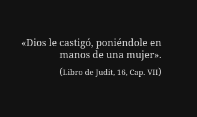

Con esta frase empezamos el libro y, por consiguiente, su análisis...

La historia comienza con una interesante conversación, en la cual mencionaré alguno de sus puntos más interesantes.

> —Vos me enseñasteis lo que es el amor, y el culto divino que os consagraba me transportaba dos mil años atrás.
> —¿Y no te guardé fidelidad sin ejemplo?
> —Ahora se trata de eso.
> —¡Ingrato!
> —No quiero hacer ningún reproche. Habéis sido una mujer divina, pero siempre mujer, y en amor, cruel como todas.
> —Es que tú llamas cruel —replicó con viveza la diosa de amor— lo que constituye precisamente el elemento de la voluptuosidad, el amor puro, la naturaleza misma de la mujer de entregarse a lo que ama y de amar lo que le place.
> —¿Qué puede haber más cruel para quien ama que la infidelidad del ser amado?
> —¡Ay! —contestó—. Somos fieles en tanto que amamos; pero vosotros exigís que la mujer sea fiel sin amor, que se entregue sin goce. ¿Dónde está ahora la crueldad, en el hombre o en la mujer? Las gentes del Norte concedéis demasiada importancia y seriedad al amor. Habláis de deberes donde no hay otra cosa que placer.

En este fragmento de la conversación hallamos puntos interesantes, como:

> Habéis sido mujer divina, pero siempre mujer, y en amor, cruel como todas.

Esta frase, en este momento, no podemos dotarla de sentido más allá de nuestra propia experiencia; así que, por mi parte, la dejaré mencionada, teniendo en cuenta que la retomaré más adelante.

> —Es que tú llamas cruel —replicó con viveza la diosa de amor— lo que constituye precisamente el elemento de la voluptuosidad, el amor puro, la naturaleza misma de la mujer de entregarse a lo que ama y de amar lo que le place.

Y aquí la diosa nos menciona una característica de la naturaleza de la mujer: «el entregarse a lo que ama y amar lo que le place». Difícil es no estar de acuerdo con esto. 

> —¿Qué puede haber más cruel para quien ama que la infidelidad del ser amado?
> —¡Ay! —contestó—. Somos fieles en tanto que amamos; pero vosotros exigís que la mujer sea fiel sin amor, que se entregue sin goce. ¿Dónde está ahora la crueldad, en el hombre o en la mujer? Las gentes del Norte concedéis demasiada importancia y seriedad al amor. Habláis de deberes donde no hay otra cosa que placer.

Y en esta oración es donde partimos la visión en dos puntos de vista: en este caso, el hombre que ama y la diosa que tiene que disfrutar de ese amor.

> Habláis de deberes donde no hay otra cosa que placer.

Cuánta verdad no guardan estas palabras... Hay quienes exigen amor de quien no puede darlo, como pedirle al fuego que alivie la sed: un sinsentido. En este caso, para la diosa cuyo fin último es el placer, no tiene sentido pedirle amor.

La conversación continúa enfatizando la naturaleza de la relación entre hombres y mujeres.

> el que no sepa sojuzgar al uno será pronto pisoteado por el otro.

> —Y lo que usted sabe mejor que yo —contestó doña Venus con arrogante tono de desprecio— es que el hombre está bajo los pies de la mujer.

> —Seguramente, y de aquí no me haga ninguna ilusión.

> —Lo que quiere decir que sois siempre mi esclavo sin ilusión, por lo cual no tendré yo misericordia.

> —¡Señora!

> —¿No me conocéis aún? Sí, soy cruel; ya que tanto te gusta esa palabra. ¿Pero no tengo derecho para serlo? El hombre es el que solicita, la mujer es lo solicitado. Ésta es su ventaja única, pero decisiva. La naturaleza la entrega al hombre por la pasión que le inspira, y la mujer que no hace del hombre su súbdito, su esclavo, ¿qué digo?, su juguete, y que no le traiciona riendo, es una loca.

> —Descansan sobre diez siglos de experiencia —dijo ella en tono burlón, mientras en la sombría piel jugaban sus dedos blancos—. Cuanto más fácilmente se entrega la mujer, más frío e imperioso es el hombre. Pero cuanto más cruel e infiel le es, cuanto más juega de una manera criminal, cuanta menos piedad le demuestra, más excita sus deseos, más la ama y la desea. Siempre ha sido así, desde la bella Helena y Dalila, hasta las dos Catalinas y Lola Montes.

«Cuanto más fácilmente se entrega la mujer, más frío e imperioso es el hombre. Pero cuanto más cruel e infiel le es, cuanto más juega de una manera criminal, cuanta menos piedad le demuestra, más excita sus deseos, más la ama y la desea». Nada que se aleje de nuestra realidad...

Pero, continuando: esto no fue más que un sueño del personaje sin nombre, que al verse despertado se dirigió a la casa de don Severino, a quien le contó su sueño.

Los ojos de nuestro personaje no pudieron evitar dirigirse a un cuadro al óleo que yacía sobre la chimenea.

> Una hermosa mujer con una risa radiante que la alumbraba el rostro, de opulenta cabellera trenzada en nudos antiguos, en la cual el polvo blanco aparecía como una escarcha ligera, descansaba la cabeza sobre el brazo izquierdo, desnuda entre una oscura pelliza. Su mano derecha jugaba con una fusta, y su pie, desnudo, reposaba descuidado sobre un hombre, tendido ante ella como un esclavo o un perro; y este hombre, de rasgos acentuados, pero de buen dibujo, en los que se leía una profunda tristeza y una devoción apasionada, alzaba hacia ella los ojos de un mártir, exaltado y ardiente. El hombre, taburete vivo bajo los pies de la mujer, no era otro que Severino, pero sin barba, con lo que parecía tener diez años menos.

> —¡La Venus de las pieles! —exclamé, señalando el cuadro—. Tal como la vi en sueños.

> —Yo también —replicó Severino—. Sólo que yo soñé con los ojos abiertos.

Esta parte no podía simplemente omitirla porque el cuadro es el paroxismo de toda la historia. Y solo quiero que, como ejercicio mental, lo imaginen.

> Entre tanto la puerta se abrió, y una rubita encantadora, de ojos despiertos y simpáticos, vestida de seda negra, entró, trayendo fiambres y huevos para el desayuno. Severino tomó uno y le partió con el cuchillo.

> —¿No te tengo dicho que los quiero poco cocidos? —exclamó con tal violencia que hizo temblar a la joven.

> —Pero querido Sewtschu —dijo ella con timidez.

> —¿Qué Sewtschu? Lo que tienes que hacer es obedecer, —obedecer—. Y descolgó el *kantschuck* (látigo de mango corto) que pendía entre las armas.

> La linda figura huyó como una corza, tímida y ligera.

> —Espera un poco y te cojo todavía.

> —Pero Severino —dije posando mi mano sobre su brazo—, ¿cómo puedes tratar así a una mujer tan encantadora?

> —Examina un poco a la mujer —replicó guiñando finamente los ojos—. Si la hubiese acariciado, me estrangularía; pero como la he educado con el látigo, me adora.

> —¡Absurdo!

> —Exacto. Así es como hay que educar a las mujeres.

> —¡Muy bien! Vive como un pacha en tu harén, pero no me hagas teorías sobre…

> —¿Por qué no? —exclamó con viveza—. Las palabras de Goethe, «deberás ser yunque o martillo», no tienen mejor aplicación que a las relaciones entre hombre y mujer. Doña Venus te lo dijo también incidentalmente en sueños. En la pasión del hombre reposa el poder de la mujer, y ésta sabrá aprovecharse de su ventaja si aquél no se pone en guardia. Sólo queda escoger: tirano, o esclavo. Apenas se abandone, tendrá la cabeza bajo el yugo y sentirá el látigo.

> —¡Singulares máximas!

> —No son máximas, sino resultados de la experiencia —añadió bajando la cabeza—. Yo fui seriamente maltratado y curé. ¿Quieres saber cómo?

Parte II

> No escribo con tinta ordinaria, sino con la sangre escarlata que destila mi corazón, porque todas las llagas, hace tiempo cicatrizadas, se han vuelto a abrir, y mi corazón palpita y sufre, y acá y allá una lágrima cae sobre el papel.

«Confesiones de un ultrasentimental», el manuscrito en el cual Severino relata todo lo acontecido con *La Venus de las pieles*...

> No soy, casi, otra cosa que un _dilettante_ en pintura, en poesía, en música y otros pretendidos conocimientos inútiles que proporcionan a los maestros el sueldo de un ministro, ¿qué digo ministros?, pequeños potentados. Pero, ante todo, soy un _dilettante_ en amor.

¿Y qué es *dilettante*, te preguntarás? No es más que un aficionado a algo.

{width=500 height=500}

El ideal de Severino para ese momento de sus memorias podría resumirse en lo siguiente:

> Amar, ser amado, ¡qué fortuna! ¡Y con qué resplandor brilla esta dicha comparada con la cruel felicidad de adorar a una mujer que hace de nosotros un juguete, de ser el esclavo de una hermosa!

Y entre las idas y venidas de Severino, sumergido en sus ideales, entre sus diálogos con la estatua de su amada Venus, al recorrer una avenida se encuentra con todo el ideal que tanto ansiaba hecho carne: su amada Venus.

> Apresuro el paso. Observo entonces que me he equivocado de avenida, y al volver lateralmente por una senda, me encuentro cara a cara con Venus; la hermosa mujer de piedra, ¡no!; la verdadera diosa de amor, cuya sangre es caliente, cuyo pulso late, erguida ante mí en un banco de piedra. Sí, sin duda ya me ama, como aquella otra estatua que se animó para su autor. Ya la primera sorpresa ha desaparecido. La blanca cabellera de la diosa parece de piedra todavía; su blanco vestido brilla como la luna —a no ser un efecto de la seda— y cae de sus espaldas la piel sombría. Pero sus labios son rojos, sus mejillas están coloreadas, caen de sus ojos dos rayos verdes, diabólicos, sobre mí, y ríe.

> Su risa es extraña; nadie, ¡ay!, podría describirla; me quita la respiración, huyo de nuevo, a cada instante me veo obligado a detenerme para respirar, y su risa burlona me persigue siempre a través de los sombríos senderos, en la pradera alumbrada, en la fronda oscura, donde sólo penetran algunos rayos de luna. He perdido el camino, me extravío cada vez más, y gruesas gotas de sudor forman perlas en mi frente.

Podría describir toda la interesante interacción entre Severino y su Venus, cuyo nombre es Wanda von Dunajew. Pero esto se alargaría más de lo necesario, así que les mencionaré lo que considero más interesante.

>  —Usted ve el amor, y ante todo, la mujer —comenzó a decir— como algo hostil, algo contra lo que uno se defiende inútilmente, pero cuyo poder se siente como un dulce tormento, como una crueldad penetrante.
> ¿No es usted de la misma opinión?

> —No —respondió viva y categóricamente, sacudiendo la cabeza de manera que sus bucles se agitaron como llamas—. El goce sin dolor, la serena sensualidad griega es el ideal que procuro realizar en mi vida, y no creo en el amor que predican al espíritu el Cristianismo, los modernos, las almas caballerescas. Sí, miradme una vez más; soy más que un hereje, soy una pagana. «¿Crees tú que la diosa del amor haya resplandecido nunca como cuando quiso resplandecer para su Anquises en el bosque sagrado del monte Ida?». Estos versos de la elegía romana de Goethe me chocaron siempre mucho. En la naturaleza sólo se encuentra el amor de los tiempos heroicos, «cuando los dioses y las diosas se amaban». Entonces «el apetito seguía a la mirada, el goce al apetito». Todo lo demás es amanerado, afectado, falseado. En el Cristianismo, la cruz, el emblema de la cruz, para mí espantable, tiene algo de extraño, de enemigo de la naturaleza y sus inocentes impulsiones. La lucha del alma contra el mundo sensual es el evangelio del mundo moderno. No quiero saber de ello.

Desde el principio Wanda se definió a sí misma como una pagana, una seguidora del ideal griego.

> —Así es como sueñan ustedes la mujer moderna, mujercitas histéricas que en su camino de sonámbulas hacia un hombre ideal soñado no llegan a estimar al hombre mejor, y que, en medio de sus lágrimas y sus luchas, faltan diariamente a sus deberes cristianos, hoy engañadas y engañadoras mañana, siempre buscadas y eligiendo y siempre fracasadas en la elección de su amor. Esas mujeres ni son nunca dichosas ni dan la felicidad, acusando a la fatalidad siempre, en tanto que yo, para estar tranquila, quiero amar y vivir como Helena y Aspasia vivieron. La naturaleza no ha hecho durables las relaciones del hombre y la mujer.

Con estas palabras deja claro que ella lo que quiere es la libertad de su propia naturaleza, no quedar encasillada en los valores actuales de cómo debería ser una relación entre un hombre y una mujer.

> Déjeme concluir. Sólo es el egoísmo del hombre, que quiere enterrar a la mujer como un tesoro. Toda tentativa para asegurar el amor, mediante ceremonias santas, juramentos y pactos durables en el cambio constante de la existencia humana, constituye un desastre. ¿Me negará usted que nuestro mundo cristiano ha entrado en la putrefacción?

Con esto podemos ya tener una idea de los ideales de Severino y Wanda: uno que sueña con ser esclavo de su ama Venus y otra cuyas pasiones pesan por sobre todas las cosas.

> —Yo le ruego que sea usted leal para mí.

> —Le he hablado a usted lealmente. No creo poder amar a un hombre más de… —inclinó la cabeza con aire descorazonado, y reflexionó.

> —Un año.

> —¿En qué está usted pensando?… Un mes quizá.

> —¿Ni a mí?

> —¿A usted? Quizá dos meses…

> —¿Dos meses?

> —Dos meses, muy largos.

> —Señora, es una frase digna de la antigüedad.

> —Ya ve usted cómo no puede soportar la verdad. —Wanda cruzó la habitación, volvió a apoyarse en la chimenea y me miró, recostando su brazo sobre el mármol.

> —¿Qué quiere usted que haga?

> —Lo que usted quiera —respondí con resignación—; lo que le dé gusto.

> —¡Qué inconsecuente! —exclamó—. Primero me pide usted por mujer y luego se ofrece usted a mí como un juguete.

> —Wanda, os quiero.

> —Volvemos al punto de partida. Usted me ama y me quiere por mujer; pero yo no quiero contraer ningún nuevo matrimonio, porque dudo que mis sentimientos y los vuestros puedan ser duraderos.

> —¡Pero yo quiero correr el riesgo con usted!

> —Entonces se trata de saber si yo misma quiero correr ese riesgo con usted —dijo con la mayor tranquilidad—. Yo puedo imaginarme pertenecer por toda la vida a un hombre, pero ha de ser un hombre completo, que se me imponga, que me subyugue por la fuerza de su carácter, ¿comprende usted?; y este hombre —bien lo tengo sabido— apenas se enamore de veras, se hará débil, blando, ridículo; se pondrá en manos de la mujer, de rodillas ante ella, cuando yo no puedo amar de una manera duradera a un hombre que se ponga de rodillas. A pesar de todo, me es usted tan grato, que haré el ensayo con usted. Yo caí a sus pies.

> —¡Dios mío! Ya está usted de rodillas, principia usted bien —y añadió cuando me hube levantado—: Le doy a usted un año para conquistarme, o para convencerme de que podemos entendernos y vivir juntos. Si lo consigue usted, seré su mujer; una mujer, Severino, que cumplirá sus deberes estricta y concienzudamente. Durante este año viviremos como casados.

Y con este diálogo definimos toda la historia, ya que sabemos cómo termina desde el comienzo. Honestamente, cuando leí el libro por segunda vez, no recordaba completamente el final y, por unos párrafos, tuve esperanza de que a pesar de todo fuera un final feliz... Gracioso, la verdad. Y, honestamente, no quiero yo poner en palabras la escena de cómo terminó este libro.

>  No tienes derecho a quejarte. ¿No he sido siempre honrada contigo? ¿No te lo advertí varias veces? ¿No te he amado cordialmente, apasionadamente, dándote a entender de todos modos que era peligroso entregarse a mí, rebajarte ante mí? ¿No te dije que quería ser dominada? ¡Y tú quisiste ser mi esclavo, mi juguete! ¡Y habrás experimentado el mayor placer al serlo, bajo el látigo y bajo el pie de una mujer cruel y orgullosa! ¿Qué pretendes ahora? ¡Los malos instintos dormitaban en mí y tú los despertaste. Si ahora me complazco en torturarte, en maltratarte, tú eres el único responsable; tú has hecho de mí lo que soy, y ahora eres bastante cobarde, miserable e inhumano para quejarte ante mí!

Lo importante al final de esta historia es que el único que traicionó sus palabras e ideales fue Severino, entregándose como esclavo a la mujer que ama y luego reprochándole por tratarlo como tal...